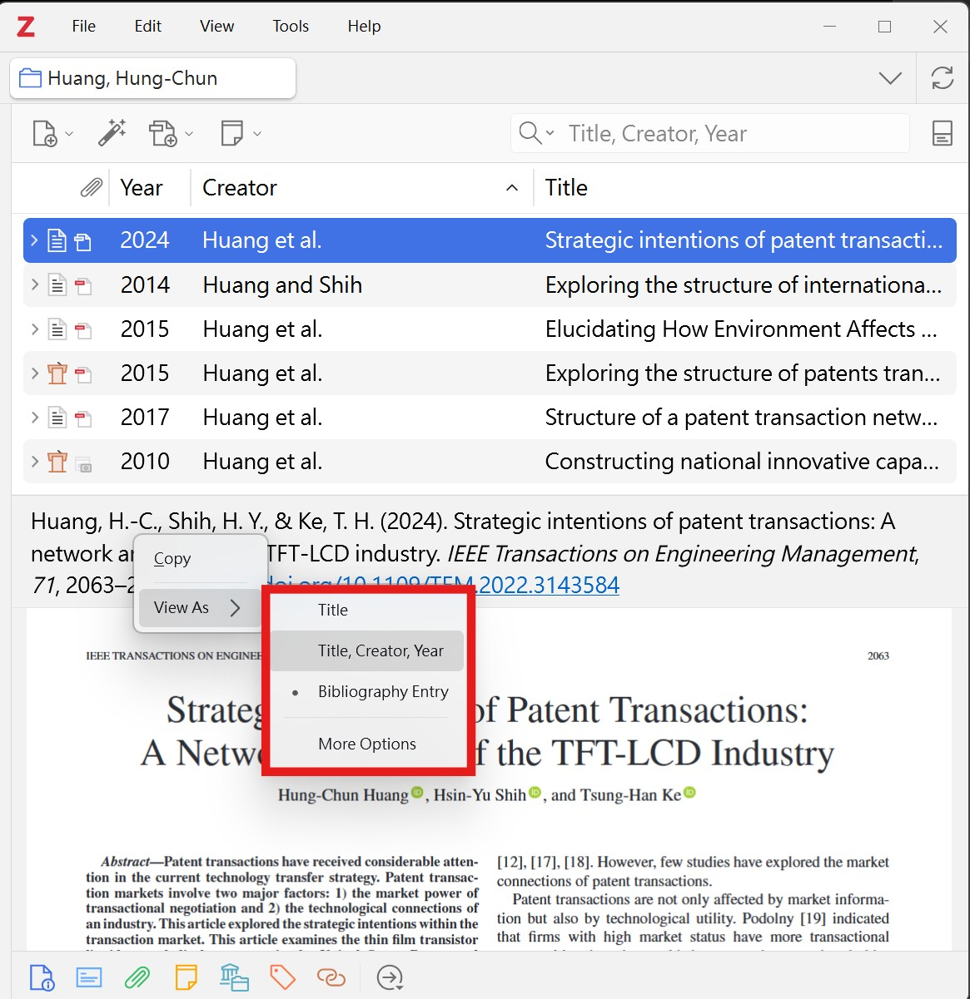
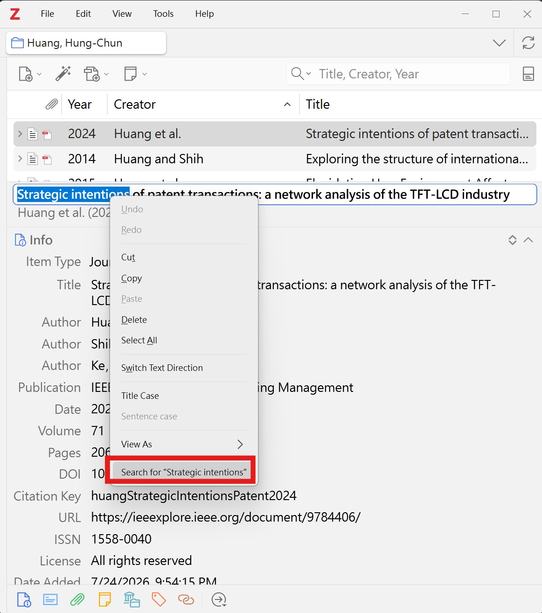
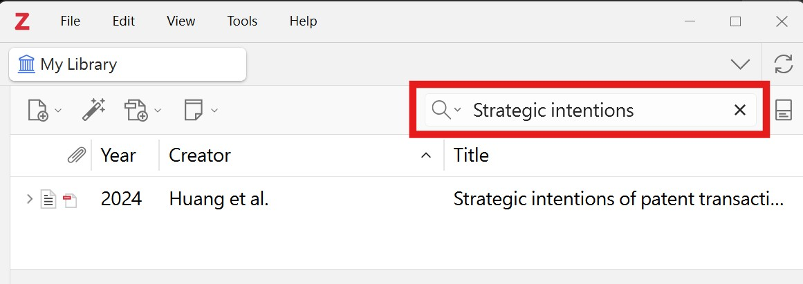

# Selection Search for Zotero
![[zotero-selection-search.png]](images/zotero-selection-search.png)
Select text in the item pane, right-click, and search your whole library for it.

**English** · [中文](#中文說明) · [日本語](#日本語)

---

Without this plugin, looking up a phrase you can see in an item's metadata takes
four steps: copy the text, click **My Library**, click the quick search box,
paste, press Enter. This plugin collapses that into one.



## Usage

1. Set the item pane header to **Title** or **Title, Creator, Year**
   (right-click the header → *View As*, or **Settings → General → Item Pane
   Header**).
2. Select any text in an editable field.
3. Right-click → **Search for "…"**

Zotero jumps to My Library and runs the search immediately.



The entry only appears when text is actually selected. It uses Zotero's default
quick search mode (*Title, Creator, Year*) rather than full-text, so the results
stay small enough to scan.

### Why the header mode matters

In **Bibliography Entry** mode the item pane header is read-only and text cannot
be selected at all, so no search entry appears. Switch to **Title** or
**Title, Creator, Year** to use this plugin.



## Installation

1. Download the `.xpi` from
   [Releases](https://github.com/anfang886/zotero-selection-search/releases).
   In Firefox-based browsers, right-click the link and choose *Save Link As* —
   a plain click may try to install it as a browser extension.
2. In Zotero: **Tools → Add-ons → gear icon → Install Add-on From File…**
3. Select the downloaded file.

Once installed, updates arrive automatically.

## Compatibility

Developed and tested on **Zotero 9** (Windows), with the interface language set
to English, Traditional Chinese, Japanese, and Russian. The manifest allows
Zotero 7 and 8 as well, but those have not been tested — reports either way are
welcome.

## How it works

The context menu is identified by **where the right-click happened**
(`popup.triggerNode`), not by what the menu contains. An earlier build matched
on the *Title Case* / *Sentence case* entries Zotero adds to this menu, which
worked in English and silently did nothing in every other language, because
those labels are translated. Location carries no language dependency.

Two details worth knowing if you are adapting this:

- Text selected inside an `<input>` or `<textarea>` is invisible to
  `window.getSelection()`. It has to be read from `selectionStart` /
  `selectionEnd`.
- The menu entry is rebuilt on every `popupshowing`, because its label carries
  the current selection.

## Building

```sh
./build.sh
```

Produces `zotero-selection-search-<version>.xpi` in `build/`. Requires `zip`.

## Development

For a faster loop than rebuilding the `.xpi`, paste the body of `bootstrap.js`
into **Tools → Developer → Run JavaScript** and attach it by hand:

```js
ZSearchMenu = makeSelectionSearch();
ZSearchMenu.init(Zotero.getMainWindow());
```

Restart Zotero before installing a packaged build, or the temporary listener and
the installed one will both fire and the entry will appear twice.

## Translations

The plugin has exactly one visible string, in `labelFor()` in `bootstrap.js`.
Only English, Chinese, and Japanese are shipped — locales those cover have been
checked by a speaker. Every other locale falls back to English on purpose,
rather than shipping a translation nobody has verified. Pull requests adding a
language you actually speak are welcome.

## Known limitations

- Only editable fields are covered. Read-only regions such as the
  **Bibliography Entry** header cannot be selected, so no entry appears there.
- The Abstract field is a `<textarea>` and may behave differently; lightly
  tested.
- Selections longer than 200 characters are ignored, on the assumption that they
  are accidental. Adjust `MAX_QUERY_LENGTH` in `bootstrap.js` if that does not
  suit you.
- The search mode is not configurable yet.

## License

MIT — see [LICENSE](LICENSE).

---

## 中文說明

<這是支「偷懶工具」> 只要您能選到字，按右鍵,直接搜尋整個書庫。

原本要四個步驟:複製文字 → 點 **My Library** → 點搜尋框 → 貼上並按 Enter。
這個插件把它壓縮成一個動作。

### 使用方式

1. 把書目面板標題模式設為 **Title** 或 **Title, Creator, Year**
   (在標題上按右鍵 → *View As*,或到 **設定 → 一般 → Item Pane Header**)。
2. 在可編輯欄位中選取文字。
3. 按右鍵 → **搜尋「…」**

Zotero 會自動跳到 My Library 並執行搜尋。

搜尋模式維持 Zotero 預設的 *Title, Creator, Year*,不會把 PDF 全文一起撈進來,
結果數量才掃得完。

### 為什麼標題模式有影響

在 **Bibliography Entry** 模式下,書目面板是唯讀的,根本選不到文字,
選單也就不會出現這一項。請切換到 **Title** 或 **Title, Creator, Year**。

### 安裝

1. 到 [Releases](https://github.com/anfang886/zotero-selection-search/releases)
   下載 `.xpi`。在 Firefox 系瀏覽器中請用右鍵「另存連結」,
   直接點擊可能會被當成瀏覽器擴充套件安裝。
2. 在 Zotero 中選 **工具 → 附加元件 → 齒輪圖示 → Install Add-on From File…**
3. 選擇下載好的檔案。

安裝後會自動更新。

### 相容性

開發與測試環境為 **Zotero 9**(Windows),介面語言測過英文、繁體中文、
日文、俄文。manifest 也允許 Zotero 7 與 8,但未經測試。

### 運作原理

選單的判斷依據是**右鍵點在哪裡**(`popup.triggerNode`),而不是選單裡寫了什麼。
早期版本是比對 Zotero 加在這個選單裡的 *Title Case* / *Sentence case* 字樣,
在英文介面下正常,換成任何其他語言就完全失效 —— 因為那兩個標籤會被翻譯。
用位置判斷則與語言無關。

---

## 日本語

アイテムペインでテキストを選択し、右クリックからライブラリ全体を検索できます。

このプラグインがない場合、メタデータ中の語句を調べるには4ステップ必要です。
テキストをコピー → **My Library** をクリック → 検索ボックスをクリック →
貼り付けて Enter。これを1回の操作にまとめます。

### 使い方

1. アイテムペインのヘッダーを **Title** または **Title, Creator, Year** に
   設定します(ヘッダーを右クリック → *View As*、または
   **設定 → 一般 → Item Pane Header**)。
2. 編集可能なフィールドでテキストを選択します。
3. 右クリック → **「…」を検索**

My Library に切り替わり、そのまま検索が実行されます。

検索モードは Zotero 標準の *Title, Creator, Year* のままです。
全文検索にしないので、結果は目視で確認できる件数に収まります。

### ヘッダーモードについて

**Bibliography Entry** モードではヘッダーが読み取り専用のため、
テキストを選択できず、メニュー項目も表示されません。
**Title** または **Title, Creator, Year** に切り替えてください。

### インストール

1. [Releases](https://github.com/anfang886/zotero-selection-search/releases)
   から `.xpi` をダウンロードします。Firefox 系ブラウザでは、
   リンクを右クリックして「名前を付けてリンク先を保存」を選んでください。
2. Zotero で **ツール → アドオン → 歯車アイコン → Install Add-on From File…**
3. ダウンロードしたファイルを選択します。

インストール後は自動的に更新されます。

### 動作環境

**Zotero 9**(Windows)で開発・テストしています。
インターフェース言語は英語・繁体字中国語・日本語・ロシア語で確認済みです。
Zotero 7 および 8 も manifest 上は許可していますが、未検証です。

### 仕組み

対象のメニューは、メニューの中身ではなく**右クリックされた場所**
(`popup.triggerNode`)で判定しています。初期版では Zotero がこのメニューに
追加する *Title Case* / *Sentence case* の文字列を照合していましたが、
これらのラベルは翻訳されるため、英語以外では何も起きませんでした。
位置による判定には言語依存がありません。
